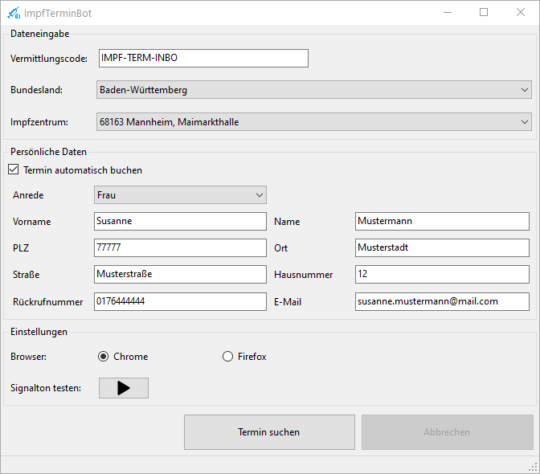

**Achtung: Aufgrund der hohen Verfügbarkeit von Impfterminen, wird das Projekt nicht weiter entwickelt.**

# ImpfTerminBot

Der ImpfTerminBot ist ein Windows 10 Tool, welches die langwierige Terminsuche für eine Corona-Schutzimpfung über das Portal [https://www.impfterminservice.de](https://www.impfterminservice.de) erleichtert. Der Bot steuert hierbei den Browser vollautomatisch, so dass der Benutzer nicht am PC warten muss um den nächsten Schritt auf der Seite ausführen zu können. Sobald ein Impftermin gefunden wurde meldet sich der Bot mit einem akustischen Signal. Hier beendet der Bot seine Arbeit und der Benutzer übernimmt die Dateneingabe. Der Benutzer hat außerdem die Wahl, alle Daten vollautomatisiert eintragen zu lassen.

## Download 
[ImpfTerminBot.msi](https://github.com/kyi87/ImpfTerminBot/releases/latest/download/ImpfTerminBot.msi)

## Anleitung
### Installation
Die Datei ImpfTerminBot.msi ausführen und den gewünschten Installations-Pfad wählen. Falls nicht vorhanden muss zuerst die .Net Runtime installiert werden ([.NetCore 3.1 Desktop Runtime x64](https://dotnet.microsoft.com/download/dotnet/thank-you/runtime-desktop-3.1.14-windows-x64-installer)). Nach der Installation wird automatisch eine Desktopverknüpfung erstellt.

### Starten der Terminsuche
Um die Terminsuche zu starten muss die Desktopverknüpfung "ImpfTerminBot" ausgeführt werden. 

Anschließend müssen die benötigten Daten eingetragen werden:

- Vermittlungscode
-  Bundesland
-  Impfzentrum 

Nach der Dateneingabe muss "Termin suchen" geklickt werden. Der Bot startet dann automatisiert die Terminsuche.

### Termin automatisch buchen

Wird "Termin automatisch buchen" gewählt wird der gefundene Termin automatisch gebucht. Es müssen alle persönlichen Daten eingegeben werden, sonst kann die Suche nicht gestartet werden. Die persönlichen Daten werden dann automatisiert in der entsprechenden Maske des Impftermin-Services ausgefüllt. Vom Impfterminservice wird dann eine Bestätigungs-E-Mail an die angegebene E-Mail Adresse gesendet. Diese E-Mail muss bestätigt werden, sonst verfällt die Termin-Reservierung.

Werden mehrere Termine gefunden, wird der erste angezeigte ausgewählt.

### Termin nicht automatisch buchen

Wird "Termin automatisch buchen" nicht gewählt, stoppt der Bot seine Arbeit sobald er einen Termin gefunden hat. Ein akustisches Signal informiert über den gefundenen Termin. Die benötigten Daten müssen dann innerhalb kurzer Zeit eingegeben werden, sonst verfällt die Terminreservierung. 

### Terminsuche Stoppen /Fortsetzen und Abbrechen

Wenn die Suche läuft kann diese mit einem Klick auf "Suche stoppen" pausiert werden. Der Benutzer kann jetzt die Steuerung übernehmen.

Mit "Suche fortsetzen" kann die Suche dann fortgesetzt werden.

Beim Klick auf "Abbrechen" wird die aktuelle Suche abgebrochen und der Browser wird geschlossen.

### Mögliche Fehlermeldungen

| Fehlermeldung                                                | Ursache                                                      |
| ------------------------------------------------------------ | ------------------------------------------------------------ |
| Ungültiger Vermittlungscode                                  | Der Vermittlungscode muss gültig sein und zum Bundesland und zum Impfzentrum passen. Außerdem muss auch die Servernummer, der Nummer aus der Bestätigungsemail entsprechen. Siehe Beispiel oben. |
| Anspruch abgelaufen. Vermittlungscode ist nicht mehr gültig. | Der Vermittlungscode wurde bereits benutzt und ist somit nicht mehr einsetzbar. |

## Einstellungen

### Browser

Es stehen Chrome und Firefox als Browser zur Wahl. Der jeweilige Browser muss installiert sein.

### Signalton testen

Beim Klick auf den Button kann der Signalton getestet werden.

## Voraussetzungen

- **Betriebssystem:** Nur unter Windows (10) lauffähig
- **Browser:** Chrome oder Firefox
- **Laufzeitumgebung:** [.NetCore 3.1 Desktop Runtime x64](https://dotnet.microsoft.com/download/dotnet/thank-you/runtime-desktop-3.1.14-windows-x64-installer)
- **Vermittlungscode:** Es muss ein gültiger Vermittlungscode und die passende Servernummer vorhanden sein

## Unterstützung

