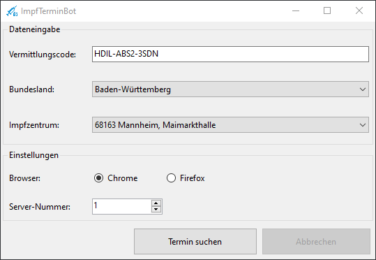

# ImpfTerminBot

Der ImpfTerminBot erleichtert die Terminsuche für eine Corona-Schutzimpung über das Portal [https://www.impfterminservice.de](https://www.impfterminservice.de). Der ImpfTerminBot steuert hierbei den Browser vollautomatisch und meldet sich sobald ein Termin gefunden wurde. Hier beendet der ImpfTerminBot seine Arbeit und der Benutzer übernimmt die Dateneingabe.

## Download 
[ImpfTerminBot.msi](https://github.com/kyi87/ImpfTerminBot/releases/download/Latest/ImpfTerminBot.msi)

## Anleitung
### Installation
Die Datei ImpfTerminBot.msi ausführen und den gewünschten Installations-Pfad wählen. Es wird automatisch eine Desktopverknüpfung erstellt.

### Starten der Terminsuche
Um die Terminsuche zu starten muss die Desktopverknüpfung "ImpfTerminBot" ausgeführt werden. Anschließend müssen die benötigten Daten eingetragen werden:

-  Vermittlungscode
-  Bundesland (Bisher gibt es nur für Baden-Württemberg Einträge.)
-  Impfzentrum 

Nach der Dateneingabe muss "Termin suchen" geklickt werden. Der ImpfTerminBot startet dann automatisiert die Termin suche.

### Termin gefunden
Der ImpfTerminBot meldet sich akustisch sobald ein Termin gefunden wurde. Die Daten müssen dann innerhalb von 10 Minuten eingegeben werden, sonst verfällt die Terminreservierung. 

### Kein Termin gefunden
Der Vermittlungscode muss gültig sein und zum Bundsesland und zum Impfzentrum passen. Ist das nicht der Fall wird eine Fehlermeldung angezeigt.

## Vorraussetzungen
- Nur unter Windows (10) lauffähig
- Google Chrome muss installiert sein (Momentan wird nur Google Chrome unterstützt)
- Es muss ein gültiger Vermittlungscode vorhanden sein
- .NetCore 3.1 Desktop Runtime: https://dotnet.microsoft.com/download/dotnet/thank-you/runtime-desktop-3.1.14-windows-x64-installer

## TODO
- [ ] data.json für andere Bundesländer / Impfzentren erweitern
- [ ] Unsterstützung für weitere Browser
