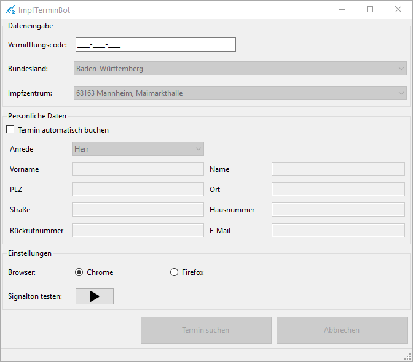

# ImpfTerminBot

Der ImpfTerminBot erleichtert die teils langwierige Terminsuche für eine Corona-Schutzimpung über das Portal [https://www.impfterminservice.de](https://www.impfterminservice.de). Der ImpfTerminBot steuert hierbei den Browser vollautomatisch, so dass der Benutzer nicht am PC warten muss um den nächsten Schritt auf der Seite ausführen zu können. Sobald ein Termin gefunden wurde meldet sich der Bot mit einem akustischen Signal. Hier beendet der ImpfTerminBot seine Arbeit und der Benutzer übernimmt die Dateneingabe. 

## Download 
[ImpfTerminBot.msi](https://github.com/kyi87/ImpfTerminBot/releases/latest/downloadImpfTerminBot.msi)

## Anleitung
### Installation
Die Datei ImpfTerminBot.msi ausführen und den gewünschten Installations-Pfad wählen. Falls nicht vorhanden muss zuerst die .Net Runtime installiert werden ([.NetCore 3.1 Desktop Runtime x64](https://dotnet.microsoft.com/download/dotnet/thank-you/runtime-desktop-3.1.14-windows-x64-installer)). Nach der Installation wird automatisch eine Desktopverknüpfung erstellt.

### Starten der Terminsuche
Um die Terminsuche zu starten muss die Desktopverknüpfung "ImpfTerminBot" ausgeführt werden. 

Anschließend müssen die benötigten Daten eingetragen werden:

-  Vermittlungscode
-  Bundesland
-  Impfzentrum 

Nach der Dateneingabe muss "Termin suchen" geklickt werden. Der ImpfTerminBot startet dann automatisiert die Terminsuche.

### Abbrechen der Terminsuche

Beim Klick auf "Abbrechen" wird die aktuelle Suche gestoppt und der Browser wird geschlossen.

### Termin gefunden
Der ImpfTerminBot meldet sich akustisch sobald ein Termin gefunden wurde. Die Daten müssen dann innerhalb von 10 Minuten eingegeben werden, sonst verfällt die Terminreservierung. 

### Mögliche Fehlermeldungen

| Fehlermeldung                                                | Ursache                                                      |
| ------------------------------------------------------------ | ------------------------------------------------------------ |
| Ungültiger Vermittlungscode                                  | Der Vermittlungscode muss gültig sein und zum Bundesland und zum Impfzentrum passen. |
| Anspruch abgelaufen. Vermittlungscode ist nicht mehr gültig. | Der Vermittlungscode wurde bereits benutzt und ist somit nicht mehr einsetzbar. |

## Vorraussetzungen
- **Betriebssystem:** Nur unter Windows (10) lauffähig
- **Browser:** Google Chrome muss installiert sein (momentan wird nur Google Chrome unterstützt)
- **Laufzeitumgebung:** [.NetCore 3.1 Desktop Runtime x64](https://dotnet.microsoft.com/download/dotnet/thank-you/runtime-desktop-3.1.14-windows-x64-installer)
- **Vermittlungscode:** Es muss ein gültiger Vermittlungscode vorhanden sein

## TODO
- [x] data.json für andere Bundesländer / Impfzentren erweitern
- [ ] Unterstützung für weitere Browser

## Unterstützung

