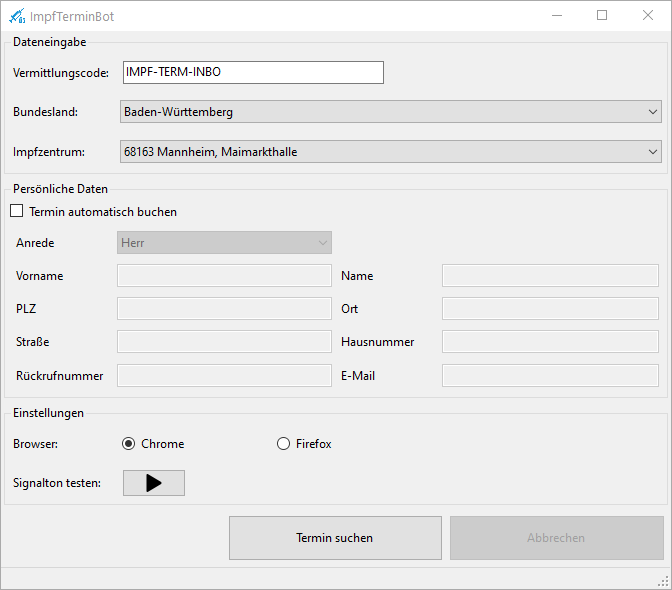

# ImpfTerminBot

Der ImpfTerminBot erleichtert die teils langwierige Terminsuche für eine Corona-Schutzimpfung über das Portal [https://www.impfterminservice.de](https://www.impfterminservice.de). Der Bot steuert hierbei den Browser vollautomatisch, so dass der Benutzer nicht am PC warten muss um den nächsten Schritt auf der Seite ausführen zu können. Sobald ein Impftermin gefunden wurde meldet sich der Bot mit einem akustischen Signal. Hier beendet der Bot seine Arbeit und der Benutzer übernimmt die Dateneingabe. 

## Download 
[ImpfTerminBot.msi](https://github.com/kyi87/ImpfTerminBot/releases/latest/download/ImpfTerminBot.msi)

## Anleitung
### Installation
Die Datei ImpfTerminBot.msi ausführen und den gewünschten Installations-Pfad wählen. Falls nicht vorhanden muss zuerst die .Net Runtime installiert werden ([.NetCore 3.1 Desktop Runtime x64](https://dotnet.microsoft.com/download/dotnet/thank-you/runtime-desktop-3.1.14-windows-x64-installer)). Nach der Installation wird automatisch eine Desktopverknüpfung erstellt.

### Starten der Terminsuche
Um die Terminsuche zu starten muss die Desktopverknüpfung "ImpfTerminBot" ausgeführt werden. 

Anschließend müssen die benötigten Daten eingetragen werden:

- Vermittlungscode
- Servernummer aus E-Mail
  - Hier muss die dreistellige Servernummer, die in der Bestätigungsemail, in welcher auch der Vermittlungscode enthalten ist, eingetragen werden.

    **Beispiel:** Hier wäre die Servernummer "001"

    

-  Bundesland
-  Impfzentrum 

Nach der Dateneingabe muss "Termin suchen" geklickt werden. Der Bot startet dann automatisiert die Terminsuche.

### Terminsuche Stoppen /Fortsetzen und Abbrechen

Wenn die Suche läuft kann diese mit einem Klick auf "Suche stoppen" pausiert werden. Der Benutzer kann jetzt die Steuerung übernehmen.

Mit "Suche fortsetzen" kann die Suche dann fortgesetzt werden.

Beim Klick auf "Abbrechen" wird die aktuelle Suche abgebrochen und der Browser wird geschlossen.

### Termin gefunden
Der Bot meldet sich akustisch sobald ein Termin gefunden wurde. Die Daten müssen dann innerhalb von 10 Minuten eingegeben werden, sonst verfällt die Terminreservierung. 

### Mögliche Fehlermeldungen

| Fehlermeldung                                                | Ursache                                                      |
| ------------------------------------------------------------ | ------------------------------------------------------------ |
| Ungültiger Vermittlungscode                                  | Der Vermittlungscode muss gültig sein und zum Bundesland und zum Impfzentrum passen. Außerdem muss auch die Servernummer, der Nummer aus der Bestätigungsemail entsprechen. Siehe Beispiel oben. |
| Anspruch abgelaufen. Vermittlungscode ist nicht mehr gültig. | Der Vermittlungscode wurde bereits benutzt und ist somit nicht mehr einsetzbar. |

## Einstellungen

### Browser

Es stehen Chrome und Firefox als Browser zur Wahl. Der jeweilige Browser muss installiert sein.

## Voraussetzungen

- **Betriebssystem:** Nur unter Windows (10) lauffähig
- **Browser:** Google Chrome oder Mozilla Firefox muss installiert sein
- **Laufzeitumgebung:** [.NetCore 3.1 Desktop Runtime x64](https://dotnet.microsoft.com/download/dotnet/thank-you/runtime-desktop-3.1.14-windows-x64-installer)
- **Vermittlungscode:** Es muss ein gültiger Vermittlungscode und die passende Servernummer vorhanden sein

## Unterstützung

